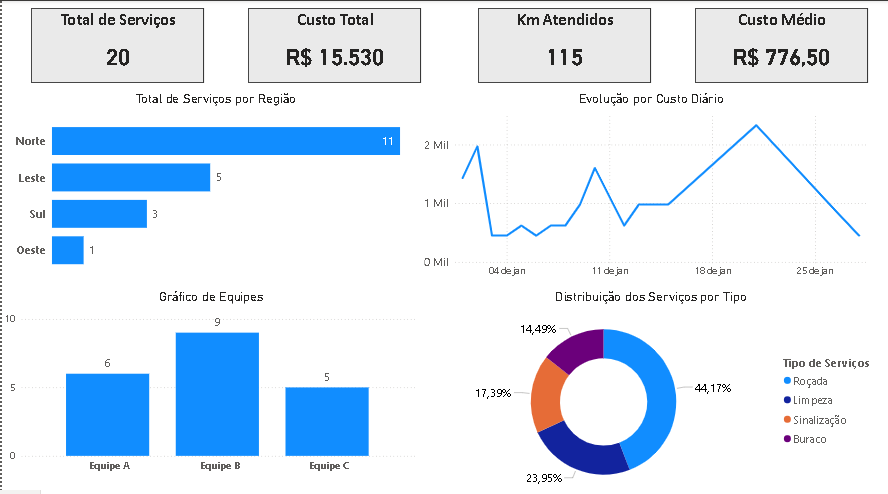

# Dashboard de Conservação de Rodovias
...

## 📌 Objetivo

Desenvolver um dashboard em Power BI para acompanhar indicadores operacionais de uma concessionária de rodovias, auxiliando no monitoramento dos serviços realizados, custos e produtividade.

---

## 📊 Tecnologias Utilizadas

- Power BI
- Power Query
- DAX
- Microsoft Excel

---

## 📁 Base de Dados

Os dados foram simulados e armazenados em planilhas do Excel, contendo informações sobre:

- Serviços executados
- Equipes
- Metas operacionais

---

## 📈 Indicadores (KPIs)

- Total de Serviços
- Custo Total
- Quilômetros Atendidos
- Custo Médio

---

## 📊 Visualizações

- Total de Serviços por Região
- Evolução do Custo Diário
- Serviços por Equipe
- Distribuição dos Serviços por Tipo

---

## 📷 Dashboard

---

-- 🚀 Objetivo do Projeto

Este projeto foi desenvolvido para praticar:

- Modelagem de dados
- Transformação de dados com Power Query
- Criação de medidas em DAX
- Desenvolvimento de dashboards no Power BI

---

## 📂 Estrutura do Projeto
datasets/
powerbi/
images/
README.md

---

Durante este projeto foram praticados:

- Importação de dados do Excel
- Tratamento de dados no Power Query
- Modelagem de dados
- Criação de KPIs em DAX
- Construção de dashboards interativos

---

## 👨‍💻 Autor

Julio Peniche
